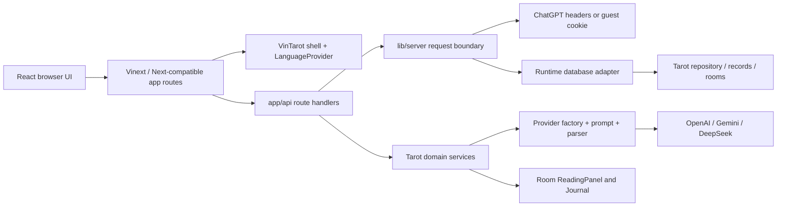
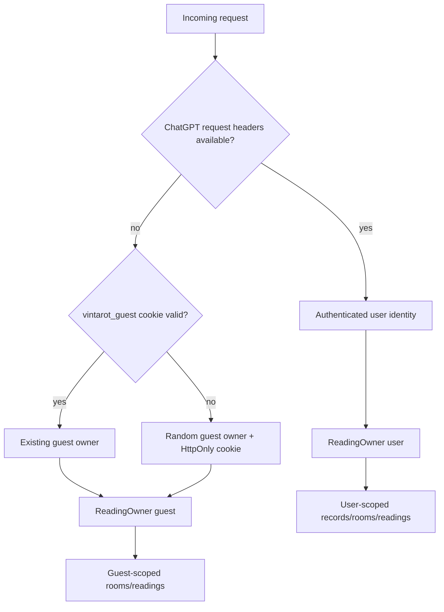
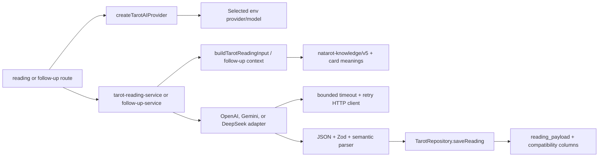

# NaTarot Architecture Map

Evidence snapshot: checked-out branch `codex/tooling-and-version-history`, `HEAD` `757b3b3`, inspected 2026-09-20. This map describes the current source tree. Deployment statements from `docs/PROJECT_STATE.md` are labelled as documented rather than independently re-verified here.

## 1. High-level architecture

NaTarot is a React 19 application using the Next-compatible Vinext runtime, Vite, TypeScript, and Cloudflare's Vite plugin. The browser renders route components from `app/`, calls server route handlers under `app/api/`, and the server reaches a D1-compatible database through `lib/runtime.ts`, `db/index.ts`, and the repository layer. Tarot AI calls are made server-side through the provider abstraction in `lib/ai/`.



## 2. Runtime and repository layout

| Area | Source of truth | Responsibility |
| --- | --- | --- |
| Route entry points | `app/page.tsx`, `app/[section]/page.tsx`, `app/create/page.tsx`, `app/room/page.tsx`, `app/guidebook/[card]/page.tsx` | Server-rendered route selection and user lookup. |
| Shared shell | `app/vintarot.tsx`, `app/layout.tsx`, `app/globals.css` | Navigation, global layout, route shells, brand surfaces, responsive CSS, motion primitives. |
| Page compositions | `app/pages.tsx`, `app/create/ritual.tsx`, `app/room/room.tsx` | Client interactions for Home sub-pages, Create, and Tarot Room. |
| UI primitives | `components/ui/`, `components/brand/`, `components/reading/` | Shared controls, brand elements, and reading result sections. |
| Tarot domain | `lib/tarot.ts`, `lib/tarot-catalog.ts`, `lib/tarot-draw.ts`, `lib/tarot-room.ts`, `lib/tarot-locales.ts` | Card data, catalog, spread positions, draw plans, room metadata, localized meanings. |
| Server boundary | `lib/server.ts`, `lib/request-identity.ts`, `lib/tarot-guest.ts` | Origin check, bounded JSON parsing, error boundary, authenticated/guest ownership. |
| AI subsystem | `lib/ai/`, `lib/tarot-reading-context.ts`, `lib/tarot-interpretation.ts`, `lib/tarot-reading-service.ts` | Prompt assembly, provider calls, response parsing, contract validation, persistence. |
| Persistence | `db/schema.ts`, `db/index.ts`, `lib/runtime.ts`, `lib/sqlite-d1.ts`, `lib/tarot-repository.ts` | D1-compatible tables, local Node SQLite adapter, SQL queries, Tarot repositories. |
| Database history | `drizzle/0000_*.sql` through `0004_reading_payload.sql`, `scripts/node-migrate.mjs` | Ordered schema/data migrations and Node production migration runner. |
| Knowledge base | `natarot-knowledge/v5/` | Versioned Tarot reading philosophy, cards, combinations, evaluation material, and prompt assembly references. |
| Deployment | `.openai/hosting.json`, `vite.config.ts`, `scripts/`, `deploy/nginx/`, `deploy/systemd/` | Sites/Cloudflare build bindings, local preview, VPS reverse proxy, service and migration startup. |
| Verification | `tests/` and `package.json` scripts | Node test runner through `tsx`, typecheck, build, lint, migration and contract tests. |

## 3. Route and UI flow

```mermaid
flowchart TD
  Home[/] --> Create[/create]
  Home --> Guidebook[/guidebook or /decks]
  Home --> Daily[/daily-spread]
  Home --> Practice[/community]
  Home --> Journal[/journal]
  Home --> Profile[/profile]
  Home --> Rooms[/invites]
  Create -->|sessionStorage vintarot:new-reading| Room[/room?ritual=1]
  Guidebook --> Card[/guidebook/:card]
  Room -->|room state and drawing| APIs[API routes]
  Journal --> Records[/api/records and saved-readings]
```

- `/` is `app/page.tsx`, which resolves the optional ChatGPT user and renders `VinTarot` without children for the Home composition.
- `/create` is `app/create/page.tsx` plus `app/create/ritual.tsx`. It stores a bounded question/topic/context draft in `sessionStorage` and redirects to `/room?ritual=1`.
- `/room` is `app/room/page.tsx` plus `app/room/room.tsx`. It loads the catalog, restores a room or draft, manages shuffle/fan/spread interactions, persists state, and opens the reading panel.
- `app/[section]/page.tsx` allows `decks`, `guidebook`, `journal`, `daily-spread`, `game`, `community`, `book`, `bookings`, `invites`, and `profile`; `decks` is a compatibility alias for the guidebook.
- `app/guidebook/[card]/page.tsx` renders a card detail route using the shared `Pages` compositions and existing card metadata.

## 4. Authentication, identity, and ownership



- `app/chatgpt-auth.ts` reads the platform-owned `oai-authenticated-user-*` headers and safely validates return paths for sign-in/sign-out navigation. It does not implement OAuth routes.
- `lib/request-identity.ts` treats the framework/platform helper as the authentication boundary and does not trust arbitrary request headers. It returns a `RequestIdentity` with a user or guest owner.
- `lib/tarot-guest.ts` creates/reads the `vintarot_guest` cookie, derives `Secure` from the effective request protocol, and provides guest ownership for Tarot sessions.
- `app/api/records`, `app/api/rooms`, Tarot session/draw/reading/follow-up routes, and saved-reading routes use server-side ownership checks. Authenticated saved readings require a real platform user; guest Save opens sign-in.
- `deploy/nginx/natarot-http.conf` clears the platform identity headers on the standalone VPS topology. This is an explicit deployment fact and means that topology falls back to guest identity unless a different trusted auth boundary is introduced.

### Security observations carried forward

These are observations for a future security mission, not fixes made by this bootstrap:

1. **Guest owner is a bearer cookie — severity estimate: medium, threat-model review required.** `lib/tarot-guest.ts` accepts a syntactically valid `vintarot_guest` cookie as the guest owner; the cookie is HttpOnly and bounded, but the source does not add a server signature or another binding. The affected boundary includes guest rooms, records, reading sessions, and room members. A future mission should decide whether possession of this value is an acceptable guest capability and should test the intended threat model before changing it.
2. **Missing `Origin` is not rejected — severity estimate: low/unknown until browser threat-model validation.** `lib/server.ts` compares `Origin` when present, while write routes do not reject a request with no `Origin`. SameSite cookies and the deployment topology may reduce practical exposure, but the repository does not prove that they cover every client. A future security mission should validate browser behavior and decide whether a stricter CSRF/origin policy is required.

## 5. Tarot domain and reading flow

```mermaid
sequenceDiagram
  participant UI as Room UI
  participant Catalog as GET /api/tarot/catalog
  participant Draw as POST /api/tarot/draw
  participant DB as TarotRepository
  participant Read as POST /api/tarot/reading
  participant AI as Provider abstraction
  participant Panel as ReadingPanel

  UI->>Catalog: load locale catalog
  Catalog->>DB: list active categories/templates/positions
  UI->>Draw: question, category, template, deck, locale, selected cards
  Draw->>DB: validate deck/template; create session/cards
  Draw-->>UI: session_id, spread, exact cards and orientations
  UI->>DB: persist room state through /api/rooms
  UI->>Read: session_id + locale
  Read->>DB: re-check session owner, cards, template, meanings
  Read->>AI: structured TarotReadingInput
  AI-->>Read: provider JSON -> schema parser
  Read->>DB: save normalized reading payload + compatibility fields
  Read-->>Panel: reading_id, provider metadata, structured reading
  Panel->>AI: optional POST /api/tarot/follow-up using saved reading
```

The draw boundary is `lib/tarot-draw.ts` and `app/api/tarot/draw/route.ts`. The dynamic catalog is represented by `lib/tarot-catalog.ts`, read from seeded tables by `lib/tarot-repository.ts`. The older `POST /api/tarot/interpret` route re-exports the canonical reading route.

The browser-side Room state carries the current phase, question/context, spread, draw plan, selected cards, positions, orientation, notes, drawing paths, and text marks. `/api/rooms` validates a bounded state schema and uses optimistic revision updates for owner/member writes.

## 6. AI provider flow and contracts



- Provider selection and server-only configuration are in `lib/ai/factory.ts`.
- Transport retry/timeout behavior is in `lib/ai/http.ts`; provider-specific request envelopes are in `openai.ts`, `gemini.ts`, and `deepseek.ts`.
- Prompt text and provider JSON contracts are in `lib/ai/prompts/tarot-reading.ts`; the selected V5 knowledge materials are assembled by `lib/ai/knowledge-v5.ts` and `lib/tarot-reading-context.ts`.
- `lib/tarot-interpretation.ts` validates bounded fields, card evidence coverage, personal opening requirements, cardinality, disclaimer, and persisted payload shape.
- `lib/tarot-reading-compat.ts` preserves the v2/v3 legacy-row path when `reading_payload` is null.
- `components/reading/` renders the structured output; it does not own prompt semantics or provider selection.

## 7. Persistence model

The tracked schema in `db/schema.ts` and migrations currently cover:

- `records`: owner-scoped profile, journal, practice, game, reader, and future booking-shaped data.
- `rooms` and `room_members`: owner/member room state, invite token, revision, timestamps.
- `decks` and `tarot_cards`: active deck/card metadata and image URLs.
- `card_meanings`: locale/orientation-specific meaning records.
- `spread_categories`, `spread_templates`, `spread_positions`: seeded bilingual catalog and position contracts.
- `reading_sessions` and `reading_cards`: owner-scoped question, chosen spread, card identities, orientations, and positions.
- `readings`: normalized `reading_payload` plus compatibility columns, provider model, prompt version, and timestamps.

Foreign keys connect cards to decks, meanings to cards, templates to categories, positions to templates, sessions to categories/templates, and reading cards/readings to sessions. `lib/tarot-repository.ts` is the application data-access boundary for the Tarot subsystem.

`db/index.ts` consumes the Cloudflare `DB` binding through the runtime environment. `lib/sqlite-d1.ts` adapts Node's `node:sqlite` connection to the D1-shaped API used by the app. `scripts/node-migrate.mjs` applies ordered SQL files to the standalone database path, defaulting to `/var/lib/natarot/natarot.sqlite` unless `NATAROT_DB_PATH` is set.

## 8. Deployment architecture

Source configuration declares D1 binding `DB` and no R2 binding in `.openai/hosting.json`. `vite.config.ts` configures Vinext, Sites, Cloudflare bindings, and the local profile. `npm run dev` uses Vinext on the portable profile; `npm start` serves the built Worker through Wrangler with local state; managed Linux uses the verified build wrapper.

The tracked VPS configuration runs a Node Vinext server on `127.0.0.1:8787`, runs migrations from systemd before start, and proxies through Nginx. Nginx sets forwarded protocol/host and security headers, clears platform auth headers, and forwards upgrade traffic. The project state documents a separate Sites deployment and a VPS deployment; this bootstrap does not contact production or independently verify those claims.

## 9. Testing architecture

The repository has 62 `tests/*.test.ts` files using Node's `node:test` API and TypeScript execution through `tsx`; `package.json` does not define a dedicated `test` script. The test surface includes:

- UI/brand/route contract tests for Home, Create, Guidebook, Room, reading panel, mobile and motion behavior.
- Auth/identity/origin tests in `f001-identity-boundary.test.ts`, `request-identity.test.ts`, and `server-origin.test.ts`.
- Tarot catalog, draw, migration, seed, repository, session, reading service, provider, parser, follow-up, and saved-reading tests.
- D1-shaped SQLite adapter and deployment contract tests.

The current test matrix and required commands are maintained in `docs/project/TEST_MATRIX.md`.

## 10. Explicitly unimplemented or not proven by source

- `app/api/integrations/route.ts` returns `video: false`, `payments: false`, `email: false`, and `publicAccess: false`.
- The hosting config declares no R2 bucket. No Google Drive, QR export, image export, public reading link, membership, affiliate, or admin subsystem was found in the inspected source.
- Booking UI exists, but booking creation is rejected as not open and payment/notification services are not connected.
- The room invite/member flow is implemented as private room sharing; it is not evidence of a public reading-share feature.
- A configured AI provider is a runtime concern; the local repository can pass contract tests without provider credentials, and this mission does not expose or provision any credential.
